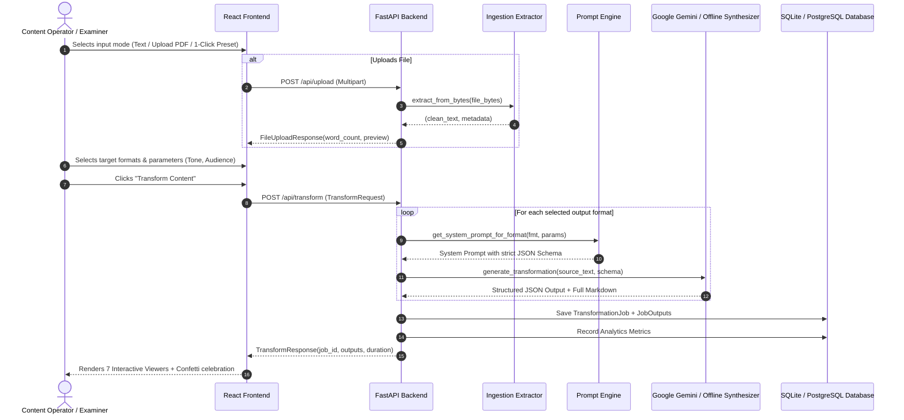

# System Architecture & Technical Diagrams
## Gen AI Platform for Automated Content Transformation

This document details the architectural blueprints, data flow diagrams, and component interactions of the Content Repurposing Engine.

---

### 1. High-Level 3-Tier Architecture Diagram

```
┌────────────────────────────────────────────────────────────────────────┐
│                        PRESENTATION LAYER                              │
│                      (React 19 + TypeScript)                           │
│                                                                        │
│   ┌─────────────────────┐   ┌──────────────────────────────────────┐   │
│   │ Content Ingestion   │   │ Parameter & Format Selector          │   │
│   │ - Text / Markdown   │   │ - Tone (Professional, Urgent, etc.)  │   │
│   │ - PDF / DOCX Drop   │   │ - Audience (C-Suite, Devs, Public)   │   │
│   │ - 1-Click Presets   │   │ - 7 Format Toggles                   │   │
│   └──────────┬──────────┘   └──────────────────┬───────────────────┘   │
│              │                                 │                       │
│              └────────────────┬────────────────┘                       │
│                               ▼                                        │
│   ┌────────────────────────────────────────────────────────────────┐   │
│   │ Interactive Results Studio (Markdown, Storyboards, Slide Decks)│   │
│   └────────────────────────────────────────────────────────────────┘   │
└───────────────────────────────────────┬────────────────────────────────┘
                                        │ REST API (JSON / Multipart)
                                        │ Port 8000
┌───────────────────────────────────────▼────────────────────────────────┐
│                         APPLICATION LAYER                              │
│                        (FastAPI - Python 3.13)                         │
│                                                                        │
│   ┌───────────────────────────┐     ┌──────────────────────────────┐   │
│   │ Ingestion Engine          │     │ Prompt Orchestrator          │   │
│   │ - Text Cleaner & Normalizer│    │ - 7 Structured JSON Schemas  │   │
│   │ - PyPDF / python-docx     │     │ - Dynamic Variable Injection │   │
│   └─────────────┬─────────────┘     └──────────────┬───────────────┘   │
│                 │                                  │                   │
│                 └─────────────────┬────────────────┘                   │
│                                   ▼                                    │
│   ┌────────────────────────────────────────────────────────────────┐   │
│   │ Dual AI Generation Core                                        │   │
│   │  ├─ Online: Google Gemini API (gemini-2.5-flash / 1.5-flash)   │   │
│   │  └─ Offline: Context-Aware Synthesizer Engine (Zero-cost demo) │   │
│   └───────────────────────────────┬────────────────────────────────┘   │
│                                   │                                    │
│   ┌───────────────────────────────┴────────────────────────────────┐   │
│   │ Multi-Format Exporter (.md, .txt, .html, .json, .pptx)         │   │
│   └────────────────────────────────────────────────────────────────┘   │
└───────────────────────────────────────┬────────────────────────────────┘
                                        │ SQLAlchemy ORM
┌───────────────────────────────────────▼────────────────────────────────┐
│                          PERSISTENCE LAYER                             │
│                      (SQLite / PostgreSQL)                             │
│                                                                        │
│   ┌──────────────────────────────┐    ┌────────────────────────────┐   │
│   │ transformation_jobs          │    │ job_outputs                │   │
│   │ - id, source_title, text     │◄───┤ - id, job_id, format       │   │
│   │ - tone, audience, model_used │    │ - content_markdown, json   │   │
│   └──────────────────────────────┘    └────────────────────────────┘   │
│   ┌──────────────────────────────┐                                     │
│   │ analytics_metrics            │                                     │
│   │ - words_processed, latency   │                                     │
│   └──────────────────────────────┘                                     │
└────────────────────────────────────────────────────────────────────────┘
```

---

### 2. End-to-End Sequence Diagram



---

### 3. Transformation Module Matrix

| Format ID | Primary Audience | Key Schema Elements | UI Rendering Mode |
| :--- | :--- | :--- | :--- |
| `linkedin` | Professional Network / Recruiters | Hook, Body, Takeaways, CTA, Hashtags | Social card with copy button |
| `twitter` | Tech Community / Fast Readers | Numbered tweets (1/N), character count (<280) | Sequential tweet bubbles + thread copier |
| `advisory` | C-Suite, DevOps, SOC Analysts | Severity badge, Impact scope, Mitigation steps | High-contrast security alert matrix |
| `video_script` | Video Editors / Creators | Scene #, Timing, Camera cue, Voiceover text | Production storyboard table |
| `infographic` | Visual Designers / Executives | Metric stats, 4 section blocks, Icon tags | Grid layout with KPI callout cards |
| `exec_summary` | Board of Directors, Leadership | 200-word overview, Strategic risks, Decisions | Formal corporate memo format |
| `presentation` | Conference Presenters, Educators | Slide Title, 3-4 Bullets, Speaker Script | Interactive slide carousel + `.pptx` download |
